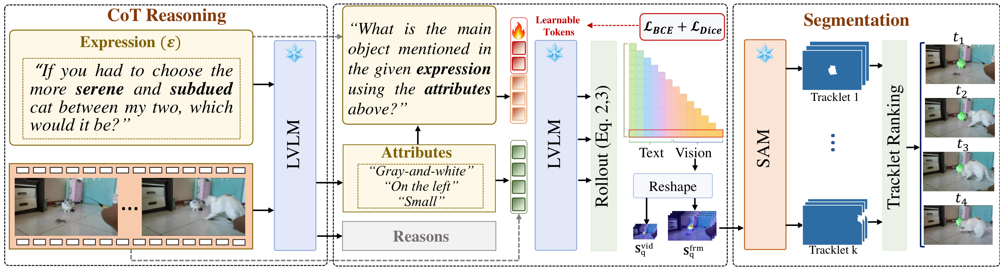

<div align="center">

<br/>

# SteerSeg Attention Steering for Reasoning Video Segmentation

<br/>

[](https://www.python.org/)
[](https://pytorch.org/)
[](https://developer.nvidia.com/cuda-downloads)
[](https://opensource.org/licenses/Apache-2.0)
[](https://steerseg.github.io/)

<br/>

<sub>

**[ 🌐 Project Page ](https://steerseg.github.io/)** &nbsp;·&nbsp;
**[ 📖 Details ](video-reason-segmentaion/docs/DETAILS.md)** &nbsp;·&nbsp;
**[ 🚀 Setup ](#-setup)** &nbsp;·&nbsp;
**[ 🧠 Models ](#-model-checkpoints)** &nbsp;·&nbsp;
**[ 📂 Datasets ](#-datasets)** &nbsp;·&nbsp;
**[ 📜 Cite ](#-citation)**

</sub>

</div>



<div align="center">

A frozen **Qwen2.5-VL-7B** + **SAM 2** pipeline. Two tiny soft prompts (≈ 480 KB) steer
chain-of-thought attention; SAM 2 produces tracklets that are ranked by a Pearson
score fusing **frame-level** and **video-level** signals.

</div>

<br/>

<table align="center">
<thead>
<tr>
  <th align="left">Benchmark</th>
  <th align="center">Backbone</th>
  <th align="center">𝒥</th>
  <th align="center">ℱ</th>
  <th align="center"><b>𝒥&ℱ</b></th>
</tr>
</thead>
<tbody>
<tr>
  <td>DAVIS17 (val)</td>
  <td align="center">Qwen2.5-VL-7B</td>
  <td align="center">76.8</td>
  <td align="center">83.8</td>
  <td align="center"><b>80.3</b></td>
</tr>
<tr>
  <td>ReasonVOS (val)</td>
  <td align="center">Qwen2.5-VL-7B</td>
  <td align="center">62.1</td>
  <td align="center">67.5</td>
  <td align="center"><b>64.8</b></td>
</tr>
</tbody>
</table>

---

## ✨ Highlights

- 🪶 **Tiny footprint** — only two soft prompts (~480 KB) trained; everything else stays frozen.
- 🧩 **Plug-and-play backbones** — Qwen2.5-VL · Qwen2-VL · LLaVA-OneVision · InternVL3.
- 🎯 **Cross-scale attention fusion** — weighted Pearson score over frame + video rollouts.
- ⚡ **Skip training** — pre-trained soft prompts ship with the repo; jump straight to inference.

---

## 🚀 Setup

> [!IMPORTANT]
> **Requirements** — CUDA-capable GPU · Python 3.11 / 3.12 · ~50 GB free disk for checkpoints.

```bash
# 1. Clone
git clone https://github.com/alichr/nips26-video-reason-segmentaion.git rvos
cd rvos

# 2. Create environment
python3.12 -m venv venv
source venv/bin/activate

# 3. Install PyTorch (CUDA 12.8) and the project
pip install torch==2.10.0 torchvision==0.25.0 \
  --extra-index-url https://download.pytorch.org/whl/cu128
pip install -e .

# 4. Build SAM 2 (vendored)
cd third_parts/sam2
python -m pip install --no-build-isolation -v -e .
cd ../..
```

> [!TIP]
> If SAM 2's CUDA extension fails to build (nvcc / torch CUDA mismatch), set
> `SAM2_BUILD_CUDA=0` to fall back to the slower pure-PyTorch path.

---

## 🧠 Model Checkpoints

All checkpoints land under `ckpts/`. The minimum to run inference is **SAM 2** + **Qwen2.5-VL-7B**.

```bash
pip install "huggingface_hub[cli]"
mkdir -p ckpts
```

**SAM 2 — required**

```bash
mkdir -p ckpts/sam2-hiera-large
wget -P ckpts/sam2-hiera-large/ \
  https://dl.fbaipublicfiles.com/segment_anything_2/072824/sam2_hiera_large.pt
cp third_parts/sam2/sam2/configs/sam2/sam2_hiera_l.yaml ckpts/sam2-hiera-large/
```

**Vision-Language backbone**

<table>
<thead>
<tr><th>Backbone</th><th>Role</th><th>Hugging Face ID</th></tr>
</thead>
<tbody>
<tr>
  <td><b>Qwen2.5-VL-7B</b> ⭐</td>
  <td>Headline pipeline</td>
  <td><code>Qwen/Qwen2.5-VL-7B-Instruct</code></td>
</tr>
<tr>
  <td>Qwen2-VL-7B</td>
  <td>Ablation</td>
  <td><code>Qwen/Qwen2-VL-7B-Instruct</code></td>
</tr>
<tr>
  <td>LLaVA-OneVision-7B</td>
  <td>Ablation</td>
  <td><code>llava-hf/llava-onevision-qwen2-7b-ov-hf</code></td>
</tr>
<tr>
  <td>InternVL3-8B</td>
  <td>Ablation</td>
  <td><code>OpenGVLab/InternVL3-8B-hf</code></td>
</tr>
</tbody>
</table>

```bash
# Headline backbone
huggingface-cli download Qwen/Qwen2.5-VL-7B-Instruct \
  --local-dir ckpts/Qwen2.5-VL-7B-Instruct

# Any other backbone
huggingface-cli download <HF_ID> --local-dir ckpts/<dir>
```

> [!NOTE]
> **Pre-trained soft prompts** (~480 KB each) already ship in this repo under
> `frame_only/`, `video_only/`, `frame_only_sp_hw_n64_oneEpoch_extval/`, and
> `video_only_sp_hw_n64_oneEpoch_extval/`. You can **skip training** and jump
> straight to inference.

---

## 📂 Datasets

Datasets live under `datasets/RVOSJoint/`. For inference you only need DAVIS17 + ReasonVOS.

```bash
mkdir -p datasets/RVOSJoint && cd datasets/RVOSJoint

huggingface-cli download js-hyun/decaf_data --repo-type dataset --local-dir .
tar -xf davis17_data.tar    2>/dev/null || tar -xf RVOSJoint/davis17_data.tar
tar -xf reasonvos_data.tar  2>/dev/null || tar -xf RVOSJoint/reasonvos_data.tar
cd ../..
```

<details>
<summary><b>Optional — Ref-YouTube-VOS (only needed to re-train soft prompts)</b></summary>

```bash
cd datasets/RVOSJoint
pip install gdown
gdown --folder https://drive.google.com/drive/folders/1xSXyds6d3ARViqwhAdxK268CJKP6vfZh -O .
tar -xf ref-youtube-vos.tar 2>/dev/null
cd ../..
```

Mirror: <https://youtube-vos.org/dataset/rvos/>

</details>

---

## 📁 Expected Layout

```text
rvos/
├── ckpts/
│   ├── sam2-hiera-large/
│   ├── Qwen2.5-VL-7B-Instruct/
│   └── ...                       # other backbones (optional)
└── datasets/RVOSJoint/
    ├── davis17/
    ├── ReasonVOS/
    └── ref-youtube-vos/          # optional, training only
```

---

## 📜 Citation

```bibtex
@inproceedings{cheraghian2026steerseg,
  title     = {SteerSeg: Attention Steering for Reasoning Video Segmentation},
  author    = {Cheraghian, Ali and Dastmalchi, Hamidreza},
  booktitle = {Advances in Neural Information Processing Systems (NeurIPS)},
  year      = {2026}
}
```

<br/>

<div align="center">
<sub>Released under the Apache 2.0 License.</sub>
</div>
